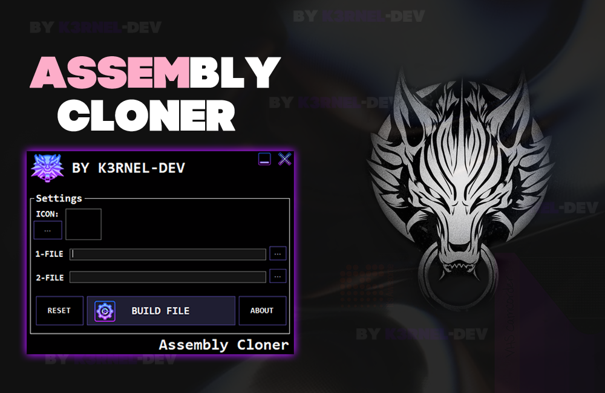

# AssemblyCloner (Beta Version)

## 📑 About
<b>Assembly Cloner - Clone the assembly information
 ! This program used Res.exe(resource hacker) for working file-resources. !</b>

### 🐊Video Tutorial:
https://github.com/K3rnel-Dev/AssemblyCloner/assets/132711888/981393ea-43e8-4bdb-b698-337f380c432e

### 📗 Updates:
 * <b>Changelog: 16/03/2024
 * Release Program</b>

### ⚡ Note:
 * <b>This project will be further developed, its beta-version, there may be bugs</b>. 
